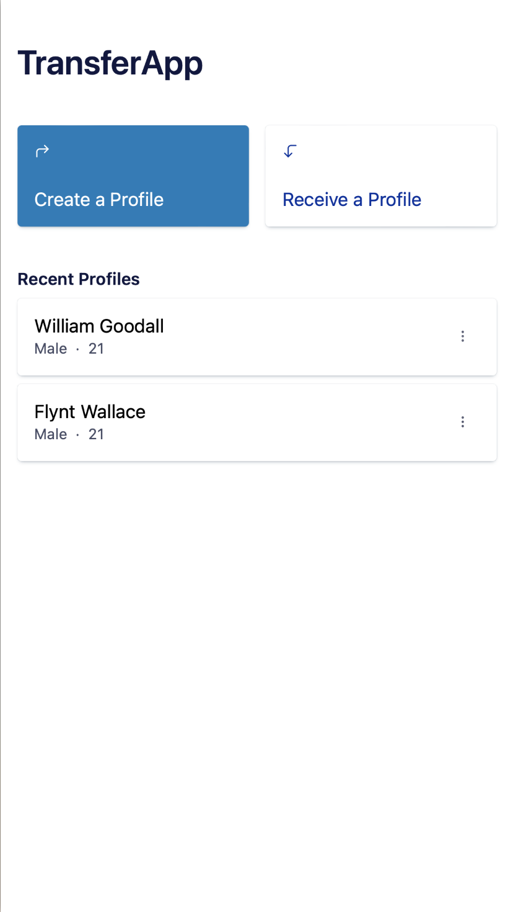
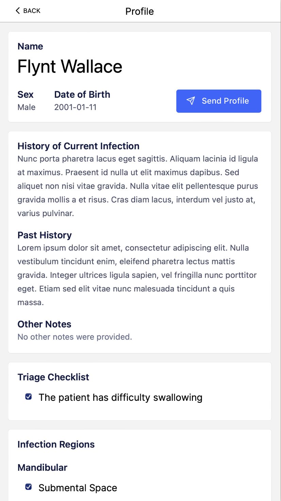
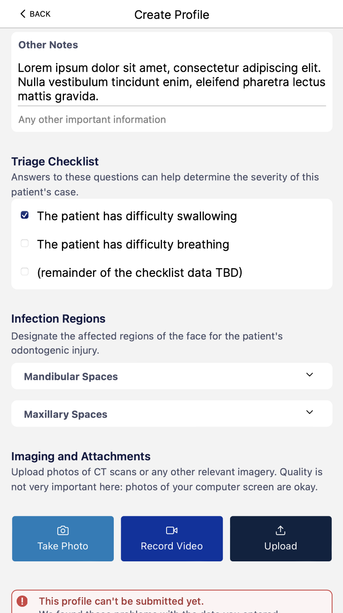

# TransferApp

<p float="left">
  
  
  
</p>

Webapp to help transfer patients with odontogenic infections.

## Running the app locally

To build and run the webapp locally, you will need:

- [Node.js](https://nodejs.org/en/download/) version 16 or above
- `yarn` (can be installed with `npm install --global yarn`)

Then, to run the webapp locally for testing:

```sh
# Install all dependencies (listed in `yarn.lock`)
$ yarn install

# Start a dev server on http://localhost:3000
$ yarn dev

# Then, open http://localhost:3000 in a browser to see the running app.
```

Next.js supports hot-reloading, so every time you save a file with a code change, you should see the change appear within a few seconds on your device without a reload.

## Deploying the app to Firebase

The app is deployed with Firebase. We use Firebase Hosting, Firestore, and Firebase Cloud Storage. Keys have been included (in `./lib/firebase.ts`) that identify the app with our public Firebase account.

To deploy the app:

```sh
# Build the app (static site generated and stored in `./out`)
$ yarn build

# Log in to Firebase
$ firebase login

# Deploy the app to Firebase
$ firebase deploy
```

After `firebase deploy` finishes, the app has been deployed---new pageloads will see any new functionality, and any updates to the Firestore or Cloud Storage security rules have been applied.

If you want to deploy the app into a different Firebase account, you'll need to do the following:

- [Create a new Firebase project](https://console.firebase.google.com), and take note of its ID.
  - Update the `.firebaserc` file, changing `projects.default` to the ID of your new project.
  - Update the `firebase.json` file, changing `hosting.site` to the ID of your new project.
- Go to Project Settings in the Firebase console, and add a new Web app.
  - Copy the configuration it generates (`const firebaseConfig = {...}`) into `./lib/firebase.ts`
- Run `firebase login`, signing into the account you used to make the new project
  - Additionally, install the Google Cloud SDK, sign in with `gcloud auth login`, and run `gcloud config set project $ID_OF_YOUR_NEW_FIREBASE_PROJECT`.
- Run `yarn build` to build the site
- Run `firebase deploy`. This will deploy the site to Firebase Hosting, and configure security rules for Firestore and Cloud Storage
- Run `./firebase/apply-cors.sh`, which will configure the CORS policy for our Cloud Storage bucket.

At this point, you should be able to load `https://$YOUR_PROJECT_ID.firebaseapp.com/`, and see a fully functioning app, served from Firebase.

## Troubleshooting

**The site is much slower running locally than it is on the website!** This is because React and Next.js are running in development mode---scripts aren't minified, and in some cases, React will do extra work to check the validity of the app's code. To see a local preview with similar performance to the deployed app, run a `yarn build`, then start a local webserver pointed to the `./out` directory.

**I see something like `/bin/sh: 1: next: not found` when I try to start the dev server!** This is because you didn't install dependencies first---run `yarn install`, and then try running `yarn dev` again.

**Why does the data look corrupted when I open it from the Firebase console?** This is by design---any data uploaded to Firebase has been encrypted with keys that are only stored in the browser's local storage. It's impossible to view any of the data that has been uploaded.

**I changed the icon for the app---why does it not appear on my phone?** If you change the icon, you also need to update the Web App Manifest (in `./public/manifest.json`) and any relevant meta tags (in `./pages/_app.tsx`).

**I tried to add a field to the form, but it's not working---something about a ZodType. What's going on?** Form fields in the app are validated by a [zod](https://github.com/colinhacks/zod) schema, in `./lib/profile.ts`. To add a field, you first need to define the validation rules for it in the schema. Then, you can add a component from `Form.tsx`, referencing the field you just made.

**My editor is putting red squiggly lines under everything. Why?** We're using TypeScript for this project. If your code does not typecheck, your editor will probably display this as an error. To fix this, make sure your code is properly type-annotated.

## Development

We're using the [Next.js](https://nextjs.org/docs) framework for [React](https://reactjs.org/docs/getting-started.html).

The app is written in [TypeScript](https://expo.dev/client): a dialect of JavaScript with type annotations and type checking. To run the type checker in the background, run `yarn tsc --watch`.

All code is auto-formatted with [Prettier](https://prettier.io). Code formatting is also enforced in CI. It's a good idea to set up your editor to format code on save, so you don't have to worry about this. To format your code, run `yarn prettier`.

## CI (GitHub Actions)

Every time code is pushed, we run the following:

- **Tests**: The entire test suite.
- **Typecheck**: make sure that all TypeScript annotations check out, and that all code is well-typed.
- **Prettier check**: make sure that all code is well-formatted and meets the style guide.
- **Schema generation**: generate a [JSON-schema](https://json-schema.org) for the profile data.

## Release Notes

### Sprint 5: `v0.5.0`

#### Features

- App reworked into a webapp running on the Next.js framework for React
- Buttons on recent profiles on home screen to delete profiles
- Video attachment functionality
- Buttons on profile create screen for directly accessing device camera for attachments
- Redesigned and polished UI
- Overhauled share button with new QR code and PIN fucntionality
- Functional end-to-end encryption of all patient data

#### Bug Fixes

- Optimized performance of webapp
- Fixed bug where image attachments would be corrupted

#### Known Issues

- Required fields popup in create profile screen doesn't correctly identify what is required

### Sprint 4: `v0.4.0`

#### Features

- Added editing existing patient profile functionality
- Added delete profile functionality for patient profiles

#### Bug Fixes

- Fixed issue that deleted large groups of profiles by accident

#### Known Issues

- App is slow, especially when trying to view a profile
- Editing profiles does not include images from the previous version

### Sprint 3: `v0.3.0`

#### Features

- Added printing functionality for patient profiles
- Automatic collapse of patient views added
- Included section to direct area of odontegenic injury
- Added highligting to designate urgent patient notices

#### Bug Fixes

- Fixed clicking on an image not correctly directing to the image view
- Profile attatchments now transfer alongside demographic information

#### Known Issues

- Cryptography operations are glacially slow, because React Native doesn't support the Web Crypto API

### Sprint 2: `v0.2.0`

#### Features

- After a profile has been completed, generate a URL containing that profile's data for transfer (#28)
- View to enter a URL to view a profile somebody else has sent you (#28)
- View to display the contents of a profile received from another user
- System to encrypt and decrypt profile data, using keys stored on-device (#30, #29)
- Added build, test, and tooling documentation to this `README.md`

#### Bug Fixes

- Fixed uselesss "receive profile" button (now: it's linked to the receive profile view)
- Removed debug functionality where local storage would get erased when tapping on a profile name

#### Known Issues

- Cryptography operations are glacially slow, because React Native doesn't support the Web Crypto API
- Profile attachments do not transfer alongside demographic information

### Sprint 1: `v0.1.0`

#### Features

- Page to enter a patient profile, complete with identity information, a triage checklist, and image/media attachments
- Validate patient information against a ruleset: checking for e.g. a valid date of birth, completed fields, and required information.
  - Surface any violations of that ruleset in the user interface, guiding users towards inputting the correct data
- Use tooling to generate a JSON-schema for the data interchange format on every push.
- Rudimentary profile log, which displays the names of completed patient profiles, in the home screen of the app.

#### Bug fixes

- Fix jank in form entry fields by changing how the app handles form contents.
- Change navigation for more flexibility in deep linking (used in features not-yet-implemented).

#### Known Issues

- Images and media are stored inefficiently, in `AsyncStorage` as base64-encoded strings.
- No data encryption has been implemented at this time.
